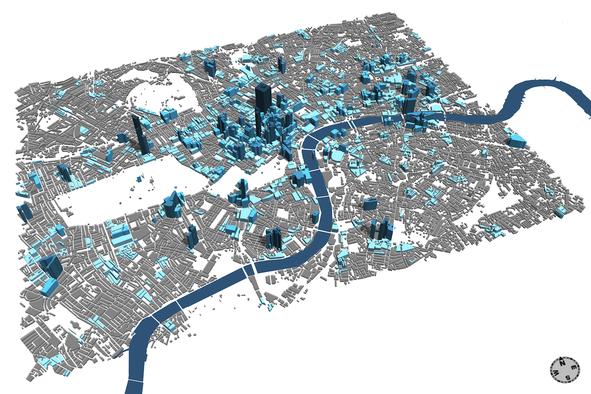

# Mapping London Buildings in Real Time using Twitter Data

Esri's CityEngine is a 3D GIS tool which allows city models to be generated procedurally (that is, models are generated using a set of rules). This approach allows us to define simple conditions which govern the appearance of a city model.

Twitter provides a 'firehose' of real-time tweets, including their location if this functionality has been enabled by a user.

Using CityEngine's Python scripting functionality, we have have created a model of London in which buildings grow upwards, according to the frequency of tweets which are sent from (or in close proximity to) them.

[Video Placeholder]

## Details
Using the Tweepy Python library, we have defined a bounding box around Greater London. When a tweet is sent to our script by the Twitter streaming API, we determine whether it contains GPS data, and discard it if not.
The tweet's coordinates use a system called WGS (World Geodetic System).

The basemap we're using is a map of London building footprints, which is supplied by Ordnance Survey (link), and which can be obtained from Digimap (link). In order to place a tweet on our map, we must first convert its coordinates from WGS latitude and longitude points to Ordnance Survey National Grid coordinates.

Following the conversion we determine whether the tweet falls within the boundary of a building on our basemap. This calculation is performed in two steps:

1. We create a list of the coordinates of the centroid of each object (in this case, shape) on our map. The script then calculates which shapes fall within a user-defined radius (in this case, 100 metres).
2. For each shape obtained in step 1, we create a list of the x and y coordinates of its vertices, and apply the odd-even rule (link) to determine whether the point falls within the surface defined by the vertices. If it does, we extrude the shape by a given factor, set its colour, and define certain characteristics. In our case, we are mapping one particular attribute – location – to the shape in the form of height. However, any attribute of the tweet could be used to alter a shape's attributes. For instance, we could set the heights of the buildings to their true heights, but add a window to the buildings each time a tweet is received.

Because we're mapping tweet frequency to building height, we have had to come up with a way of slowing the growth of building heights, in order to avoid growing locations which generate a lot of tweets (e.g. the British Museum) too tall:

## Problems and Caveats

- As [Ed Manley](http://urbanmovements.co.uk) has pointed out, different Twitter clients report their location with differing levels of spatial precision, and some clients introduce a rounding error in their reported GPS coo-ordinates, which leads to 'striping' when they are visualised. In addition, it is not possible to determine whether a tweet was sent from a moving vehicle or train, or simply as someone was walking close to a building. Additional uncertainty is introduced by the conversion from WGS to BNG, which is only accurate to ~5m.
- The Twitter Streaming API only delivers filtered (in our case, by location) messages up to the "streaming cap", and there is no way of determining whether the sample that we receive is "representative". This is a limitation inherent to the API.
